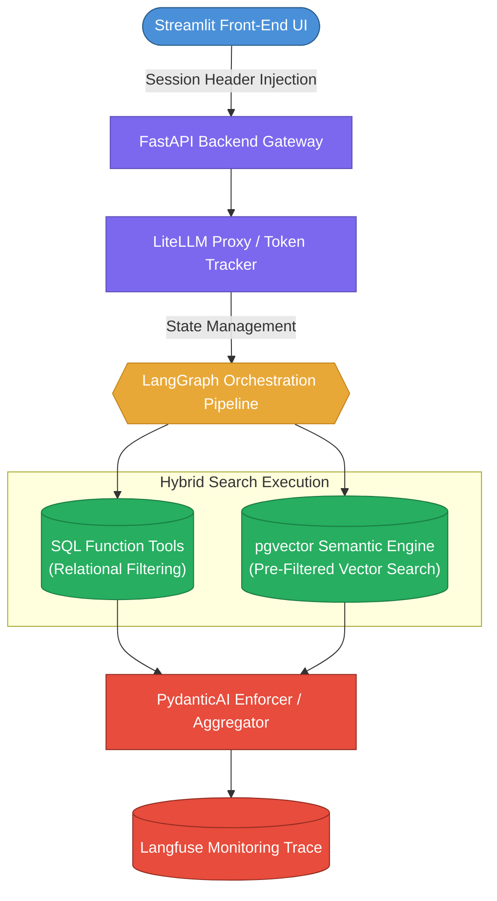

# ARCHITECTURAL BLUEPRINT: "My personal NBA Scout"

> Author: Stefan Grandl, 2026

#### A High-Performance, Multi-Tenant Hybrid-RAG Platform for NBA Personnel Analytics

## 1. System Objective & Core Design

The objective of this project is to build a production-grade analytics platform that allows sports executives to run complex, natural language queries against a unified sports data infrastructure. The core architectural challenge is the seamless, performant, and secure fusion of two distinct data layers:

1. **The Global Relational Layer (Structured):** Public historical performance metrics, box scores, and salary data. This data is static, shared across all users, and stored in a normalized relational database.
2. **The Isolated Tenant Layer (Unstructured):** Confidential team-specific scouting notes, internal draft board evaluations, and strategic commentary. This data is dynamic, stored as text embeddings, and strictly hidden behind multi-tenant security boundaries.

The system guarantees **Absolute Decision Provenance**. It completely isolates numerical filtering from semantic search, ensuring that every natural language response is backed by an auditable trail of deterministic SQL rows and vector chunk IDs.

---

## 2. Technical Stack & Component Interaction

The platform is designed for explicit isolation of duties and local execution in a home server environment (Proxmox, Docker Compose, Portainer):

### Data Isolation & Access Controls

* **Shared Storage Optimization:** Global player data and base text descriptions are indexed a single time in a shared schema. This prevents duplicate embedding generation and minimizes vector index memory footprint.
* **Deterministic Filtering:** Multi-tenancy is enforced on the database level via explicit access-control maps (`tenant_players`). The active tenant context is injected into every database interaction, ensuring that text matching is strictly restricted to the user's explicit permissions.

### The Hybrid Search Execution Loop

When processing an enterprise query (e.g., *"Identify free agents with a Player Efficiency Rating (PER) above 20 whose scouting notes confirm elite perimeter defense"*), the system executes a strict execution graph via **LangGraph**:

1. **Relational Pre-Filtering:** The orchestration layer invokes a parameterized Python tool that queries the indexed PostgreSQL tables, returning a definitive list of player IDs that meet the exact statistical constraints.
2. **Constrained Vector Retrieval:** The vector engine takes the allowed player IDs and performs a targeted similarity search using **pgvector**. This completely eliminates the post-filtering data omission issue typical in multi-tenant RAG pipelines.
3. **Re-Ranking & Enforcement:** Raw retrieval chunks are validated via a cross-encoder re-ranker. **PydanticAI** then structures the final payload, enforcing a typed JSON schema that pairs the core recommendation with explicit, clickable database and chunk citations.

---

## 3. Implementation Phases & Data Lifecycle

* **Phase 1: Deterministic Data Ingestion & Layout-Aware Parsing**
Historical statistics and baseline biographical texts are fetched via the `nba_api` and curated Kaggle CSV datasets. Unstructured textual assets are processed through **Docling**. The pipeline utilizes layout-aware parsing to extract document structure, transforming raw sheets and paragraphs into metadata-rich markdown chunks tagged with structural hierarchy and player IDs.
* **Phase 2: Database Layer & Index Optimization**
The storage engine is powered by PostgreSQL with the `pgvector` extension. Relational indices are optimized using standard B-Trees. Text embeddings are indexed via a Hierarchical Navigable Small World (**HNSW**) strategy. The index configuration is tailored to match high-recall constraints while remaining within fixed hardware memory allocations.
* **Phase 3: Controlled Agent Tooling**
Agent interactions are restricted to deterministic tool execution. The system prompt denies the LLM the ability to write or execute arbitrary raw SQL. Instead, it interacts with the data layer exclusively via validated Python functions. This architecture guarantees predictable database performance and prevents prompt-injection security vectors.
* **Phase 4: Observability, Guardrails & Cost Controls**
**LiteLLM** serves as the central API routing gateway. A proactive middleware service continuously tracks consumed input/output tokens against a tenant quota database, immediately rejecting queries that breach operational thresholds. Complete execution visibility is achieved by routing all processing steps through **Langfuse** for detailed tracing and latency mapping.
* **Phase 5: Automated Evaluation Suite**
The platform integrates a programmatic testing suite running via PyTest and **Langfuse Evals**. System performance is validated using fixed ground-truth datasets. Every modification to the prompt architecture or chunking configuration automatically evaluates retrieval hit rates, context recall, and answer faithfulness before deployment.

---

## 4. Deployment Environment

The system runs identically in two environments without code changes:

* **Development:** Local Docker Engine on the developer's laptop.
* **Production:** Proxmox homelab node orchestrated via a Portainer Stack pulling from the Git repository.

### Constraints

* **No hardcoded paths.** All physical volume sources (large datasets, persistent DB storage) are bound via `${HOST_SHARED_DATA_DIR}`, injected at runtime through `.env`. Neither application code nor `docker-compose.yml` may contain absolute paths.
* **Relative build contexts.** Docker Compose `build.context` keys must use relative paths (e.g., `./src/backend`) so Portainer can resolve them inside the cloned repository root.
* **Stateless containers.** All state resides on the mounted network directory. No configuration layers or system updates are persisted inside containers.

---

## 5. Alignment with Advanced Engineering Concepts

This architecture is built to explicitly demonstrate mastery of core production-grade principles while avoiding infrastructure overhead unrelated to the data layer.

### Core Capabilities Demonstrated:

* **Production Hybrid RAG Architecture:** Replaces simple semantic lookups with a strict split between relational queries, layout-aware vector chunking (Docling), and cross-encoder re-ranking.
* **Rigid Multi-Tenant Isolation:** Proves secure multi-tenant filtering on a shared physical database using dynamic context injection.
* **Verifiable Decision Provenance:** Implements explicit, structural tracing from the raw prompt down to database primary keys and exact vector locations.
* **Cost Governance & Quota Management:** Models commercial resource allocation via an active token-quota middleware layer.
* **Eval-Driven Development:** Establishes a concrete, automated pipeline to mathematically measure LLM output consistency and generation quality.

### Excluded Scope (Intentionally Omitted):

* **Kubernetes (K8s) Orchestration:** The service architecture relies on Docker Compose to manage container borders. Cluster management, automated scaling policies, and ingress routing are skipped to preserve focus on the application layer.
* **Model Context Protocol (MCP) Infrastructure:** Tool execution uses native, idiomatic Python function calls. Establishing independent MCP servers with protocol-handshake layers is omitted to maintain a lean, highly maintainable codebase.
* **Advanced Quantization Tuning:** The pgvector database relies on standard HNSW index setups optimized for raw recall, bypassing highly specific hardware-level vector quantization matrices.
